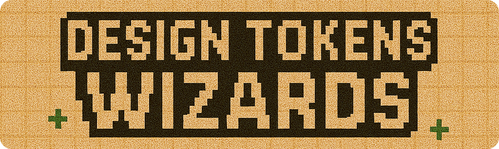
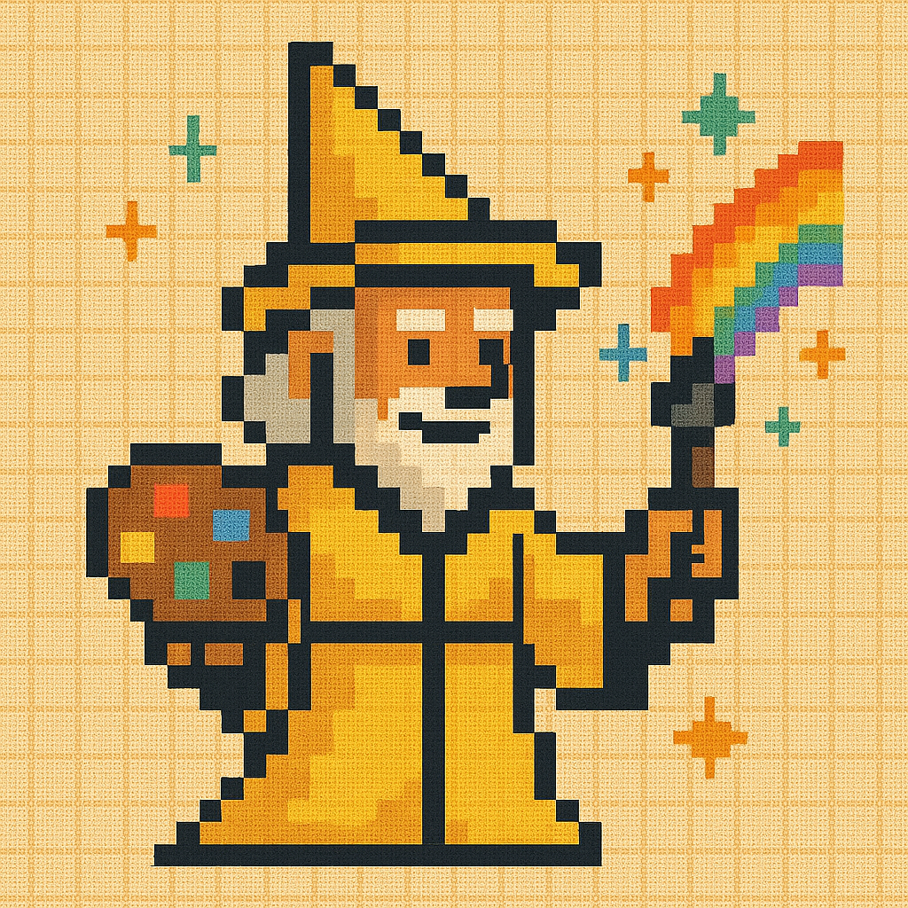
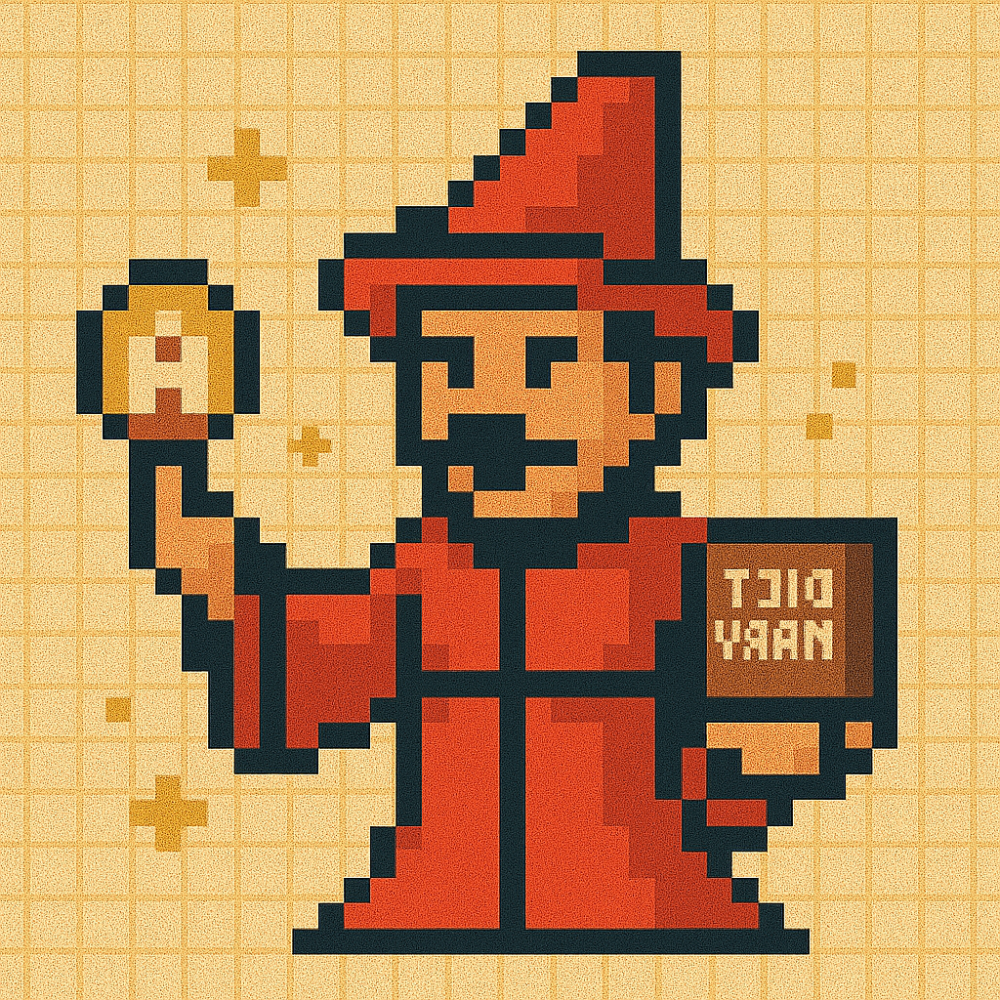
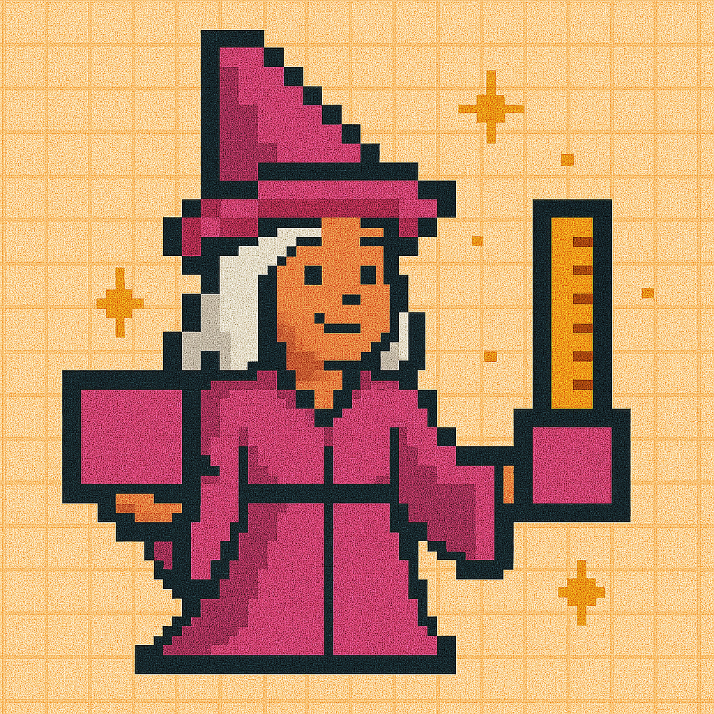
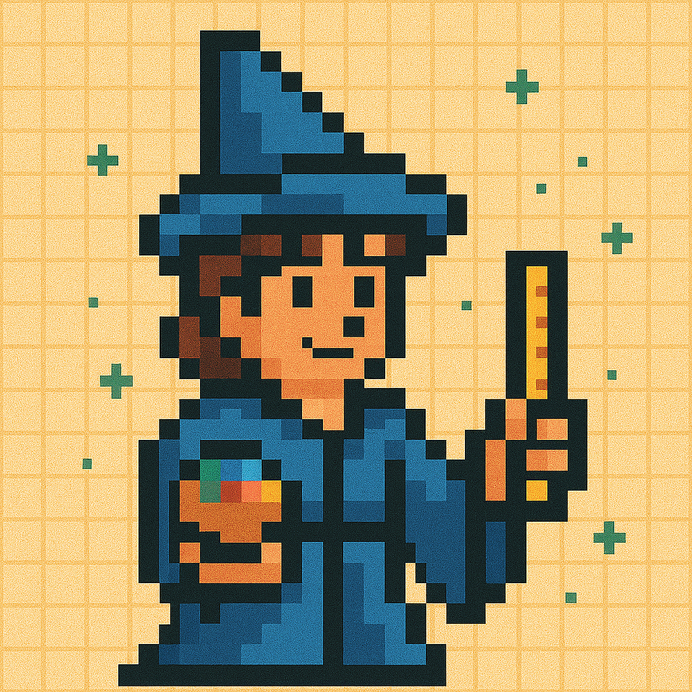
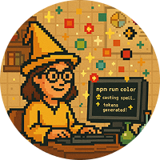

Una potente colección de scripts para generar y gestionar tokens de diseño para tu sistema de diseño. Cada maguito se especializa en crear tipos específicos de tokens, garantizando consistencia y eficiencia en tus proyectos.

## 📋 Tabla de Contenidos

- [🧙 Primeros Pasos](#-primeros-pasos)
- [🗂 Estructura del Proyecto](#-estructura-del-proyecto)
- [🎨 Maguito de Tokens de Color](#-maguito-de-tokens-de-color)
- [🔤 Maguito de Tokens de Tipografía](#-maguito-de-tokens-de-tipografía)
- [🔳 Maguito de Tokens de Espaciado](#-maguito-de-tokens-de-espaciado)
- [📏 Maguito de Tokens de Tamaño](#-maguito-de-tokens-de-tamaño)
- [🔲 Maguito de Tokens de Radio de Borde](#-maguito-de-tokens-de-radio-de-borde)
- [🧹 Hechizo de Limpieza de Tokens](#-hechizo-de-limpieza-de-tokens)
- [🔄 Hechizo de Fusión de Tokens](#-hechizo-de-fusión-de-tokens)
- [📦 Dependencias](#-dependencias)
- [📝 Licencia](#-licencia)
- [❓ Solución de Problemas y Preguntas Frecuentes](#-solución-de-problemas-y-preguntas-frecuentes)
- [📬 Contacto y Soporte](#-contacto-y-soporte)
- [🤝 Contribución](#-contribución)

## 🧙 Primeros Pasos

1. **Instala Node.js**  
   Descarga e instala [Node.js](https://nodejs.org/) en tu ordenador.

2. **Instala VS Code**  
   Descarga e instala [Visual Studio Code](https://code.visualstudio.com/) para una experiencia de desarrollo mejorada.

3. **Abre la Terminal**

   - **VS Code:** Presiona `` Ctrl + ` `` (Windows/Linux) o `` Cmd + ` `` (Mac)
   - **Terminal del Sistema:**
     - Windows: `Windows + R`, escribe `cmd`
     - Mac: `Command + Space`, escribe `terminal`
     - Linux: `Ctrl + Alt + T`

4. **Descarga/Clona el Repositorio**

   [Descargar ZIP](https://github.com/fulviabuonanno/design-tokens-wizards/archive/refs/heads/master.zip)

   o

   Clonar Repo

   ```sh
   git clone https://github.com/fulviabuonanno/design-tokens-wizards.git
   cd design-tokens-wizards
   ```

5. **Instala las Dependencias**

   ```sh
   npm install
   ```

6. **Ejecuta los Scripts**  
   Elige entre los siguientes maguitos:

| Maguito de Tokens        | Nombre del Script | Comando         | Descripción                            | Versión  |
| ------------------------ | ----------------- | --------------- | -------------------------------------- | -------- |
| 🟡 **COLOR WIZ**         | `color-wiz.js`    | `npm run color` | Genera y gestiona tokens de color      | 2.8.2 ✨ |
| 🔴 **TYPOGRAPHY WIZ**    | `typo_wiz.js`     | `npm run typo`  | Genera y gestiona tokens de tipografía | 1.2.3 ✨ |
| 🟣 **SPACE WIZ**         | `space_wiz.js`    | `npm run space` | Genera y gestiona tokens de espaciado  | 1.7.2 ✨ |
| 🔵 **SIZE WIZ**          | `size_wiz.js`     | `npm run size`  | Genera y gestiona tokens de tamaño     | 1.7.2 ✨ |
| 🟢 **BORDER RADIUS WIZ** | `radii_wiz.js`    | `npm run radii` | Genera y gestiona tokens de radio      | 1.7.2 ✨ |

| Hechizo         | Nombre del Script | Comando         | Descripción                                      | Versión  |
| --------------- | ----------------- | --------------- | ------------------------------------------------ | -------- |
| **MERGE SPELL** | `merge_spell.js`  | `npm run merge` | Combina todos los archivos de tokens en uno solo | 1.3.2 ✨ |
| **CLEAR SPELL** | `clear_spell.js`  | `npm run clear` | Elimina todos los archivos generados de una vez  | 1.2.2    |

Leyenda:
✨ Parche // 🌟 Cambio Menor // ✅ Cambio Mayor

## 🗂 Estructura del Proyecto

```
src/
  wizards/         # Todos los scripts de Maguitos (color, typo, space, size, radii)
  spells/          # Scripts de utilidad (merge, clear)
  config/          # Configuración y scripts auxiliares
  assets/          # Imágenes y otros recursos estáticos
output_files/      # Donde se guardan los tokens generados
  tokens/
    json/          # Archivos de tokens en JSON
    css/           # Archivos de tokens en CSS
    scss/          # Archivos de tokens en SCSS
  final/           # Archivos finales de tokens combinados
info/              # Información adicional del proyecto
```

## 🎨 **Maguito de Tokens de Color**



Versión 2.8.2

¡Conjura una paleta deslumbrante para tu sistema de diseño con el Maguito de Tokens de Color 🧙! Este script mágico te guía a través de cada paso para crear tokens de color flexibles y escalables, sin necesidad de libro de hechizos.

1. **Invoca el Maguito**  
   Lanza el hechizo de color en tu terminal:

   ```sh
   npm run color
   ```

2. **Elige el Tipo de Token**  
   Selecciona la base de tus tokens de color:

   - **Colores Globales**
   - **Colores Semánticos** (próximamente; actualmente redirige a Global)

3. **Establece la Categoría**  
   (Opcional) Organiza tus tokens por categoría (ej., primitivos, fundamentos, núcleo, básicos, esenciales, global, raíces, o personalizado). Ingresa el tuyo si lo deseas.

4. **Establece el Nivel de Nomenclatura**  
   (Opcional) Añade un nivel de nomenclatura para mayor claridad (ej., color, colour, paleta, esquema, o personalizado).

5. **Ingresa el Color Base**  
   Proporciona un código de color HEX (ej., `#FABADA`). Vista previa de tu tono mágico.

6. **Nombra tu Color**  
   Dale a tu color un nombre único (ej., `azul`, `amarillo`, `rojo`). El maguito asegura que no haya duplicados en tu estructura elegida.

7. **Selecciona el Tipo de Escala**  
   Decide cómo se generarán tus paradas de color:

   - **Incremental:** 100, 200, 300, 400
   - **Ordinal:** 01, 02, 03, 04 o 1, 2, 3, 4
   - **Alfabético:** A, B, C, D o a, b, c, d
   - **Stops Semánticos:** dark, base, light, etc.

8. **Establece el Número de Paradas**  
   Elige cuántos stops (tonos) generar (1-20, dependiendo del tipo de escala).

9. **Personaliza el Rango de Mezcla de Color**  
   (Opcional) Establece los porcentajes mínimos y máximos de mezcla.
   (Predeterminado: 10%-90%) para controlar cómo tu color base se mezcla con blanco y negro para los stops más claros y oscuros.

10. **Vista Previa y Confirma**  
    Revisa tu escala de color en una tabla, completa con nombres de tokens y valores HEX.

    - Para escalas numéricas (Incremental/Ordinal), puedes mapear el HEX base actual a una clave numérica media (por ejemplo, `500` o `600`). La clave `base` se elimina y la clave numérica elegida pasa a ser el stop medio canónico para ese color.
    - Esta preferencia (p. ej., mapear a `500`) se recuerda y se aplica automáticamente a los colores que agregues en la misma sesión, para asegurar consistencia.
    - Para escalas no numéricas (Alfabética/Semántica), la vista previa se muestra tal cual.

11. **Expande tu Paleta**  
    Añade más colores y repite el proceso tantas veces como quieras.

    - Si mapeaste el base a una clave numérica en un color anterior (p. ej., `500`), el maguito aplicará automáticamente el mismo mapeo al nuevo color para mantener una estructura consistente.

12. **Exporta y Convierte**  
    Cuando termines, el maguito:

    - Exporta los tokens en formato Tokens Studio JSON (HEX por defecto)
    - Ofrece convertir los tokens a RGB, RGBA y/o HSL
    - Genera archivos CSS y SCSS para cada formato
    - Limpia archivos no utilizados

    Tus artefactos mágicos aparecerán en:

    - JSON: `output_files/tokens/json/color/color_tokens_{format}.json`
    - CSS: `output_files/tokens/css/color/color_variables_{format}.css`
    - SCSS: `output_files/tokens/scss/color/color_variables_{format}.scss`

13. **Revisa tu Hechizo**  
    El mago lista todos los archivos actualizados, nuevos y eliminados.

---

**Nota:**

- El soporte para colores semánticos está planeado pero aún no disponible.
- Todos los pasos permiten entrada personalizada y confirmación antes de continuar.
- El maguito asegura que no haya nombres de color duplicados en tu estructura elegida.
- Siempre puedes reiniciar un paso para ajustar tu entrada.

---

## 🔤 **Maguito de Tokens de Tipografía**



Versión 1.2.3

¡Crea una poción tipográfica armoniosa para tu sistema de diseño con el Maguito de Tokens de Tipografía 🧙! Este maguito te ayuda a combinar familias de fuentes, tamaños, pesos, espaciados y alturas en un sistema tipográfico cohesivo.

1. **Invoca el Maguito**  
   Lanza el hechizo de tipografía en tu terminal:

   ```sh
   npm run typo
   ```

2. **Elige tus Propiedades**  
   Selecciona qué propiedades tipográficas deseas configurar:

   - Familias de Fuentes (Font Family)
   - Tamaños de Fuente (Font Size)
   - Pesos de Fuente (Font Weight)
   - Espaciado entre Letras (Letter Spacing)
   - Alturas de Línea (Line Height)

3. **Configura la Familia de Fuente**

   - Nombra tu propiedad (fontFamily, font-family, fonts, ff, o personalizado)
   - Define 1-3 familias de fuentes con alternativas
   - Elige convención de nomenclatura:
     - Semántica (primaria, secundaria, terciaria)
     - Basada en propósito (título, cuerpo, detalles)
     - Ordinal (1, 2, 3)
     - Alfabética (a, b, c)

4. **Configura el Tamaño de Fuente**

   - Nombra tu propiedad (fontSize, font-size, size, fs, o personalizado)
   - Selecciona tipo de escala:
     - Cuadrícula de 4 Puntos
     - Cuadrícula de 8 Puntos
     - Escala Modular
     - Intervalos Personalizados
     - Escala Fibonacci
   - Elige unidad (px, rem, em)
   - Define 1-12 tamaños con convención de nomenclatura:
     - Tallas (xs, sm, md, lg, xl)
     - Incremental (10, 20, 30)
     - Ordinal (1, 2, 3)
     - Alfabética (a, b, c...)

5. **Configura el Peso de Fuente**

   - Nombra tu propiedad (fontWeight, font-weight, weight, fw, o personalizado)
   - Selecciona de pesos estándar (100-900)
   - Elige convención de nomenclatura:
     - Tallas (xs a xl)
     - Semántica (fino a negrita)
     - Ordinal (1 a 5)
     - Basada en propósito (cuerpo, encabezado...)

6. **Configura el Espaciado entre Letras**

   - Nombra tu propiedad (letterSpacing, letter-spacing, tracking, ls, o personalizado)
   - Elige tipo de escala:
     - Escala Predeterminada (-1.25 a 6.25)
     - Valores Personalizados
   - Selecciona unidad (em, rem, %)
   - Define 1-7 valores con convención de nomenclatura:
     - Tallas (xs a xl)
     - Incremental (100, 200...)
     - Ordinal (01, 02... o 1, 2...)
     - Alfabética (a, b, c...)

7. **Configura la Altura de Línea**

   - Nombra tu propiedad (lineHeight, line-height, leading, lh, o personalizado)
   - Elige tipo de escala:
     - Escala Predeterminada 1 (1.1, 1.25, 1.5, 1.6, 1.75, 2.0)
     - Escala Predeterminada 2 (1.0, 1.2, 1.5, 1.6, 2.0)
     - Valores Personalizados
   - Elige convención de nomenclatura:
     - Tallas (xs a xl)
     - Semántica (apretado, normal, suelto, relajado, espacioso)
     - Ordinal (1 a 5)
     - Basada en propósito (cuerpo, encabezado, display, compacto, expandido)
     - Incremental (100, 200...)
     - Alfabética (a, b, c...)

8. **Vista Previa de tus Tokens**  
   Para cada propiedad, verás una tabla de vista previa mostrando tus valores configurados.

9. **Genera tus Artefactos**  
   Una vez confirmado, el maguito:

   - Exporta tus tokens en formato Tokens Studio JSON
     Almacenado en: `output_files/tokens/typography/typography_tokens.json`
   - Crea archivos CSS y SCSS con tus tokens como variables
     Almacenado en `output_files/tokens/css/typography/typography_variables.css` y `output_files/tokens/scss/typography/typography_variables.scss`

10. **Finaliza tu Hechizo**  
    Revisa los archivos de salida e integra tus tokens de tipografía en tu sistema.

---

**Nota:**

- Cada paso incluye guías y recomendaciones de accesibilidad.
- El maguito sugiere valores óptimos mientras permite personalización.
- Siempre puedes reiniciar un paso para ajustar tu entrada.

---

## 🔳 **Maguito de Tokens de Espaciado**



Versión 1.7.2

¡Conjura el sistema de espaciado perfecto para tu diseño con el Maguito de Tokens de Espaciado 🧙! Este maguito te ayuda a crear un conjunto armonioso de tokens de espaciado que traerán equilibrio y ritmo a tus diseños.

1. **Invoca el Maguito**  
   Lanza el hechizo de espaciado en tu terminal:

   ```sh
   npm run space
   ```

2. **Define la Unidad Base**  
   La unidad base predeterminada para los tokens de espaciado es píxeles (px).

3. **Nombra tus Tokens de Espaciado**  
   Proporciona un nombre para tus tokens de espaciado (ej., space, spc).

4. **Selecciona el Tipo de Escala**  
   Elige una escala predefinida para tus tokens:

   - Sistema de Cuadrícula de 4 Puntos
   - Sistema de Cuadrícula de 8 Puntos
   - Escala Modular (basada en multiplicador)
   - Intervalos Personalizados
   - Escala Fibonacci

5. **Establece el Número de Valores**  
   Especifica cuántos valores de espaciado quieres generar (ej., 6 valores para una escala de pequeño a grande).

6. **Elige la Convención de Nomenclatura**  
   Selecciona un patrón de nomenclatura para tus tokens de espaciado:

   - Tallas (xs, sm, md, lg, xl)
   - Incremental (100, 200, 300)
   - Ordinal (1, 2, 3)
   - Alfabética (A, B, C o a, b, c)

7. **Vista Previa de tus Tokens**  
   El maguito mostrará la vista previa de tus tokens de espaciado:

   ```
   Nombre: Space
   ┌─────────┬─────────┐
   │ Escala  │ Valor   │
   ├─────────┼─────────┤
   │ 01      │ 16px    │
   │ 02      │ 24px    │
   │ 03      │ 32px    │
   │ 04      │ 40px    │
   └─────────┴─────────┘
   ```

8. **Genera tus Artefactos**  
   Una vez confirmado, el maguito:

   - Exporta tus tokens en formato Tokens Studio JSON
     Almacenado en: `output_files/tokens/space/space_tokens_{unit}.json`
   - Crea archivos CSS y SCSS con tus tokens como variables
     Almacenado en `output_files/tokens/css/space/space_variables_{unit}.css` y `output_files/tokens/scss/space/space_variables_{unit}.scss`

9. **Finaliza tu Hechizo**  
   Revisa los archivos de salida e integra tus tokens de espaciado en tu sistema.

---

## 📏 **Maguito de Tokens de Tamaño**



Versión 1.7.2

¡Conjura el sistema de tamaños perfecto para tu diseño con el Maguito de Tokens de Tamaño 🧙! Este maguito te ayuda a crear un conjunto armonioso de tokens de tamaño que traerán consistencia y precisión a tus diseños.

1. **Invoca el Maguito**  
   Lanza el hechizo de tamaño en tu terminal:

   ```sh
   npm run size
   ```

2. **Define la Unidad Base**  
   La unidad base predeterminada para los tokens de tamaño es píxeles (px).

3. **Nombra tus Tokens de Tamaño**  
   Proporciona un nombre para tus tokens de tamaño (ej., size, sz).

4. **Selecciona el Tipo de Escala**  
   Elige una escala predefinida para tus tokens:

   - Sistema de Cuadrícula de 4 Puntos
   - Sistema de Cuadrícula de 8 Puntos
   - Escala Modular (basada en multiplicador)
   - Intervalos Personalizados
   - Escala Fibonacci

5. **Establece el Número de Valores**  
   Especifica cuántos valores de tamaño quieres generar (ej., 6 valores para una escala de pequeño a grande).

6. **Elige la Convención de Nomenclatura**  
   Selecciona un patrón de nomenclatura para tus tokens de tamaño:

   - Tallas (xs, sm, md, lg, xl)
   - Incremental (100, 200, 300)
   - Ordinal (1, 2, 3)
   - Alfabética (A, B, C o a, b, c)

7. **Vista Previa de tus Tokens**  
   El maguito mostrará la vista previa de tus tokens de tamaño:

   ```
   Nombre: Size
   ┌─────────┬─────────┐
   │ Escala  │ Valor   │
   ├─────────┼─────────┤
   │ 01      │ 16px    │
   │ 02      │ 24px    │
   │ 03      │ 32px    │
   │ 04      │ 40px    │
   └─────────┴─────────┘
   ```

8. **Genera tus Artefactos**  
   Una vez confirmado, el maguito:

   - Exporta tus tokens en formato Tokens Studio JSON
     Almacenado en: `output_files/tokens/size/size_tokens_{unit}.json`
   - Crea archivos CSS y SCSS con tus tokens como variables
     Almacenado en `output_files/tokens/css/size/size_variables_{unit}.css` y `output_files/tokens/scss/size/size_variables_{unit}.scss`

9. **Finaliza tu Hechizo**  
   Revisa los archivos de salida e integra tus tokens de tamaño en tu sistema.

---

## 🔲 **Maguito de Tokens de Radio de Borde**


Versión 1.7.2

¡Conjura el sistema de radio de borde perfecto para tu diseño con el Maguito de Tokens de Radio de Borde 🧙! Este maguito te ayuda a crear un conjunto armonioso de tokens de radio de borde que traerán elegancia y consistencia a tus elementos de UI.

1. **Invoca el Maguito**  
   Lanza el hechizo de radio de borde en tu terminal:

   ```sh
   npm run radius
   ```

2. **Define la Unidad Base**  
   La unidad base predeterminada para los tokens de radio de borde es píxeles (px).

3. **Nombra tus Tokens de Radio de Borde**  
   Proporciona un nombre para tus tokens de radio de borde (ej., radius, rad).

4. **Selecciona el Tipo de Escala**  
   Elige una escala predefinida para tus tokens:

   - Sistema de Cuadrícula de 4 Puntos
   - Sistema de Cuadrícula de 8 Puntos
   - Escala Modular (basada en multiplicador)
   - Intervalos Personalizados
   - Escala Fibonacci

5. **Establece el Número de Valores**  
   Especifica cuántos valores de radio de borde quieres generar (ej., 6 valores para una escala de pequeño a grande).

6. **Elige la Convención de Nomenclatura**  
   Selecciona un patrón de nomenclatura para tus tokens de radio de borde:

   - Tallas (xs, sm, md, lg, xl)
   - Incremental (100, 200, 300)
   - Ordinal (1, 2, 3)
   - Alfabética (A, B, C o a, b, c)

7. **Vista Previa de tus Tokens**  
   El maguito mostrará la vista previa de tus tokens de radio de borde:

   ```
   Nombre: Radius
   ┌─────────┬─────────┐
   │ Escala  │ Valor   │
   ├─────────┼─────────┤
   │ 01      │ 4px     │
   │ 02      │ 8px     │
   │ 03      │ 12px    │
   │ 04      │ 16px    │
   └─────────┴─────────┘
   ```

8. **Genera tus Artefactos**  
   Una vez confirmado, el maguito:

   - Exporta tus tokens en formato Tokens Studio JSON
     Almacenado en: `output_files/tokens/radius/radius_tokens_{unit}.json`
   - Crea archivos CSS y SCSS con tus tokens como variables
     Almacenado en `output_files/tokens/css/radius/radius_variables_{unit}.css` y `output_files/tokens/scss/radius/radius_variables_{unit}.scss`

9. **Finaliza tu Hechizo**  
   Revisa los archivos de salida e integra tus tokens de radio de borde en tu sistema.

---

## 🧹 **Hechizo de Limpieza de Tokens**


Versión 1.2.2

¡Conjura una pizarra limpia con el Hechizo de Limpieza de Tokens 🧙! Este hechizo te ayuda a eliminar todos los archivos de tokens generados, dándote un nuevo comienzo para tu sistema de diseño.

1. **Invoca el Hechizo**  
   Lanza el hechizo de limpieza en tu terminal:

   ```sh
   npm run clear
   ```

2. **Vista Previa de tu Limpieza**  
   El hechizo mostrará una vista previa de los archivos a eliminar:

   ```
   Archivos a eliminar:
   - output_files/tokens/color/
   - output_files/tokens/typography/
   - output_files/tokens/space/
   - output_files/tokens/size/
   - output_files/tokens/border-radius/
   - output_files/tokens/final/
   ```

3. **Confirma tu Limpieza**  
   Una vez confirmado, el hechizo:

   - Eliminará todos los archivos de tokens generados
   - Limpiará todos los directorios de salida
   - Reiniciará el espacio de trabajo para un nuevo comienzo

4. **Finaliza tu Hechizo**  
   Tu espacio de trabajo ahora está limpio y listo para nueva generación de tokens.

---

**Nota:**

- El hechizo asegura una limpieza completa de todos los archivos generados.
- Siempre puedes reiniciar un paso para ajustar tu selección.
- Asegúrate de hacer una copia de seguridad de cualquier archivo importante antes de ejecutar este hechizo.

---

## 🔄 **Hechizo de Fusión de Tokens**


Versión 1.3.2

¡Conjura un sistema de diseño unificado fusionando tus archivos de tokens con el Hechizo de Fusión de Tokens 🧙! Este hechizo combina múltiples archivos de tokens en un único archivo cohesivo del sistema de diseño.

1. **Invoca el Hechizo**  
   Lanza el hechizo de fusión en tu terminal:

   ```sh
   npm run merge
   ```

2. **Selecciona los Archivos de Tokens**  
   Elige los archivos de tokens que quieres fusionar:

   - Tokens de color
   - Tokens de tipografía
   - Tokens de espaciado
   - Tokens de tamaño
   - Tokens de radio de borde

3. **Configura los Formatos de Tokens**  
   El hechizo revisará automáticamente qué archivos están disponibles en tu carpeta `output/tokens`. Para cada tipo de token encontrado, selecciona tu formato preferido:

   - Colores: Elige entre HEX, RGB, RGBA, o HSL
   - Tipografía: Selecciona unidades (px, rem, em)
   - Espaciado: Elige unidades (px, rem, em)
   - Tamaño: Selecciona unidades (px, rem, em)
   - Radio de Borde: Elige unidades (px, rem, em)

4. **Elige la Convención de Nomenclatura**  
   Selecciona cómo quieres que se nombren tus tokens en el archivo fusionado:

   - camelCase (ej., primaryColor, fontSize)
   - kebab-case (ej., primary-color, font-size)
   - snake_case (ej., primary_color, font_size)
   - PascalCase (ej., PrimaryColor, FontSize)

5. **Genera tus Artefactos**  
   Una vez confirmado, el hechizo:

   - Creará un archivo de tokens fusionado en formato Tokens Studio JSON
     Almacenado en: `output_files/final/tokens.json`
   - Creará archivos CSS y SCSS con todos tus tokens como variables
     Almacenado en `output_files/final/tokens.css` y `output_files/final/tokens.scss`

6. **Finaliza tu Hechizo**  
   Revisa los archivos fusionados e intégralos en tu sistema de diseño.

---

**Nota:**

- El hechizo asegura que todos tus tokens se combinen correctamente.
- Siempre puedes reiniciar un paso para ajustar tu selección.
- Los archivos fusionados están listos para usar en tu flujo de trabajo de desarrollo.

---

## Creado con Amor en Barcelona por Fulvia Buonanno 🪄❤️



Descubre más sobre los maguitos en: [Sitio Web de Design Tokens Wizards](https://designtokenswizards.framer.website/)

Si eres apasionado por los sistemas de diseño y los tokens, esta herramienta es tu compañera perfecta, permitiéndote crear tokens sin esfuerzo. Para los fanáticos de RPG o JRPG, esta herramienta evocará una sensación de nostalgia, combinando vibraciones de juegos clásicos con tu flujo de trabajo de diseño. 🧩

Creado con amor por Fulvia Buonanno, una Diseñadora de Sistemas de Diseño basada en Barcelona, esta herramienta tiene como objetivo cerrar la brecha entre el diseño y el desarrollo, haciendo que los tokens sean más accesibles, especialmente para los recién llegados a este mundo mágico. 🧙

## 📦 Dependencias

A continuación se muestra una lista completa de todas las dependencias utilizadas en este proyecto:

| Dependencia    | Versión | Descripción                                                              | Repositorio                                                       |
| -------------- | ------- | ------------------------------------------------------------------------ | ----------------------------------------------------------------- |
| **chalk**      | ^5.4.1  | Estilizado de cadenas de terminal hecho bien                             | [chalk/chalk](https://github.com/chalk/chalk)                     |
| **cli-table3** | ^0.6.5  | Tablas unicode bonitas para la línea de comandos                         | [cli-table3](https://github.com/cli-table/cli-table3)             |
| **inquirer**   | ^12.4.2 | Una colección de interfaces de usuario comunes de línea de comandos      | [SBoudrias/Inquirer.js](https://github.com/SBoudrias/Inquirer.js) |
| **path**       | ^0.12.7 | Módulo path de Node.js                                                   | [nodejs/node](https://github.com/nodejs/node)                     |
| **tinycolor2** | ^1.6.0  | Manipulación y conversión de color rápida y pequeña                      | [bgrins/TinyColor](https://github.com/bgrins/TinyColor)           |
| **puppeteer**  | ^20.0.0 | API de Chrome sin cabeza para Node.js para automatizar interacciones web | [puppeteer/puppeteer](https://github.com/puppeteer/puppeteer)     |

---

## 📝 Licencia

Este proyecto está licenciado bajo la Licencia MIT. Esto significa que eres libre de usar, modificar y distribuir el software siempre que se incluya el aviso de copyright original y el aviso de permiso en todas las copias o partes sustanciales del software.

Para más detalles, puedes leer el texto completo de la licencia en el archivo [LICENSE](./LICENSE) incluido en este repositorio o visitar la Iniciativa de Código Abierto para más información.

---

## ❓ Solución de Problemas y Preguntas Frecuentes

**P: ¿Cómo puedo proporcionar comentarios o reportar problemas?**  
R: ¡Bienvenimos tus comentarios! Puedes:

- Contactarnos en nuestro [sitio web](https://designtokenswizards.framer.website/)
- Completar este [formulario](https://tally.so/r/m6V6Po/)

Tus comentarios nos ayudan a mejorar la herramienta y hacerla mejor para todos. Estamos particularmente interesados en:

- Reportes de errores
- Solicitudes de características
- Mejoras en la documentación
- Comentarios sobre la experiencia de usuario
- Problemas de rendimiento

**P: ¿Recibo un error de permiso o "comando no encontrado"?**  
R: Asegúrate de tener Node.js (v18+) instalado y de estar ejecutando comandos desde la raíz del proyecto.

**P: ¿Dónde están mis archivos generados?**  
R: Revisa el directorio `output_files/`.

**P: ¿Cómo reinicio/limpio todos los archivos generados?**  
R: Ejecuta `npm run clear` para eliminar toda la salida generada.

**P: ¿Puedo usar estos tokens con mi herramienta de diseño?**  
R: ¡Sí! Los tokens se exportan en múltiples formatos (JSON, CSS, SCSS) que pueden usarse con la mayoría de las herramientas de diseño y entornos de desarrollo.

**P: ¿Cómo actualizo los tokens después de hacer cambios?**  
R: Simplemente ejecuta el maguito nuevamente con tus nuevos valores. Los archivos se actualizarán automáticamente.

**P: ¿Puedo personalizar la convención de nomenclatura para mis tokens?**  
R: ¡Sí! Cada maguito te permite elegir entre diferentes convenciones de nomenclatura (tallas, números incrementales, números ordinales, etc.).

**P: ¿Cuál es la diferencia entre el Hechizo de Fusión y el Hechizo de Limpieza?**  
R: El Hechizo de Fusión combina todos tus archivos de tokens en un único archivo unificado, mientras que el Hechizo de Limpieza elimina todos los archivos generados para comenzar de nuevo.

**P: ¿Cómo contribuyo al proyecto?**  
R: Consulta nuestra sección de [Contribución](#-contribución) para ver las pautas. ¡Bienvenimos todas las contribuciones!

**P: ¿Puedo usar estos tokens en mi proyecto comercial?**  
R: ¡Sí! Este proyecto está licenciado bajo MIT, lo que significa que puedes usarlo libremente en cualquier proyecto, incluyendo comerciales.

**P: ¿Qué formatos de color son compatibles?**  
R: El maguito de Tokens de Color es compatible con formatos HEX, RGB, RGBA y HSL. Puedes elegir tu formato preferido durante el proceso de generación.

**P: ¿Puedo usar fuentes personalizadas en el maguito de Tipografía?**  
R: ¡Sí! Puedes especificar cualquier familia de fuentes, incluyendo fuentes personalizadas. Solo asegúrate de incluir alternativas adecuadas para una mejor compatibilidad multiplataforma.

**P: ¿Qué unidades son compatibles para espaciado y tamaño?**  
R: Los maguitos de Espaciado y Tamaño son compatibles con unidades px, rem y em. Puedes elegir tu unidad preferida durante el proceso de generación.

**P: ¿Cómo mantengo la consistencia entre diferentes proyectos?**  
R: Usa el Hechizo de Fusión para combinar tokens de diferentes proyectos, y considera crear una biblioteca de tokens para componentes compartidos.

**P: ¿Cuál es la mejor manera de organizar mis archivos de tokens?**  
R: Recomendamos organizar los tokens por categoría (color, tipografía, espaciado, etc.) y usar el Hechizo de Fusión para combinarlos cuando sea necesario.

**P: ¿Puedo automatizar la generación de tokens en mi pipeline de CI/CD?**  
R: ¡Sí! Los maguitos pueden ejecutarse desde la línea de comandos, lo que los hace perfectos para la automatización en tu flujo de trabajo de desarrollo.

**P: ¿Puedo usar estos tokens con mi framework CSS?**  
R: ¡Sí! Los tokens se exportan en formatos estándar (CSS, SCSS) que pueden usarse con cualquier framework CSS o CSS vanilla.

**P: ¡Algo más no funciona!**  
R: Por favor [abre un issue](https://github.com/fulviabuonanno/design-tokens-wizards/issues) o [contáctame](mailto:designtokenswizards@gmail.com).

---

## 📬 Contacto y Soporte

Para preguntas, sugerencias o reportes de errores, por favor abre un issue o [contáctame](mailto:designtokenswizards@gmail.com).

---

## 🤝 Contribución

¡Las contribuciones, issues y solicitudes de características son bienvenidas!  
No dudes en revisar la [página de issues](https://github.com/fulviabuonanno/design-tokens-wizards/issues) o enviar un pull request.

Por favor, consulta [CONTRIBUTING.md](CONTRIBUTING.md) para ver las pautas.

### ☕️ Apoya el Proyecto

Si encuentras esta herramienta útil y quieres mostrar tu aprecio, ¡considera invitarme un café! Tu apoyo me ayuda a mantener y mejorar los Design Tokens Wizards, haciéndolo aún más mágico para todos.

[](https://ko-fi.com/fbuonanno)

Cada café me ayuda a:

- Añadir nuevas características y mejoras
- Corregir errores y mantener el código
- Crear más documentación y ejemplos
- ¡Mantener la magia viva! ✨

Incluso una pequeña contribución hace una gran diferencia en mantener este proyecto prosperando. ¡Gracias por ser parte de nuestra comunidad mágica! 🧙‍♀️

---
