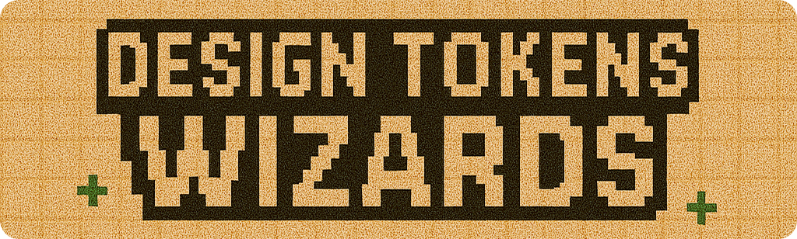
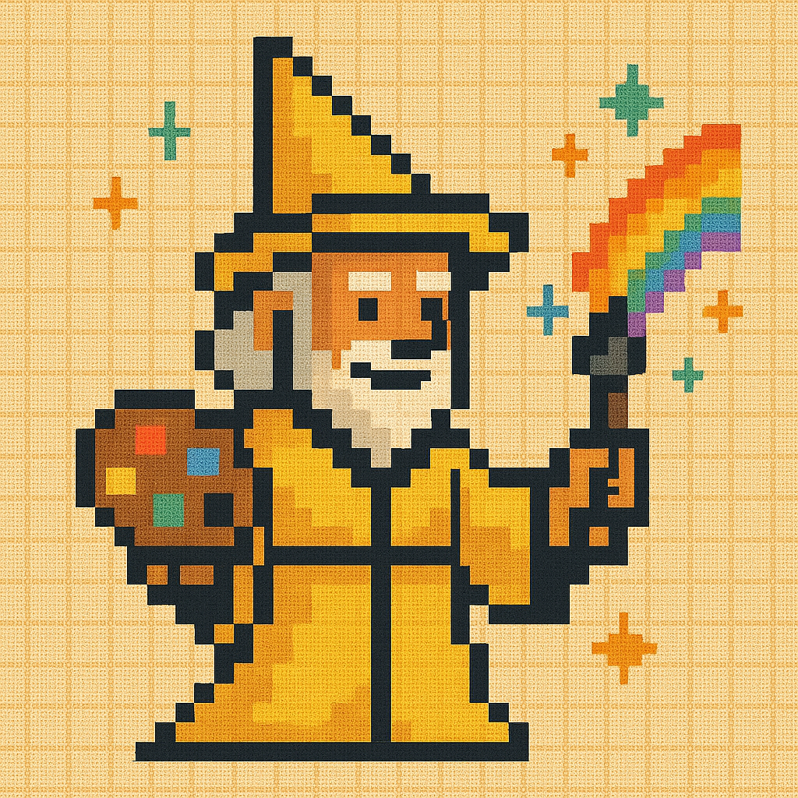
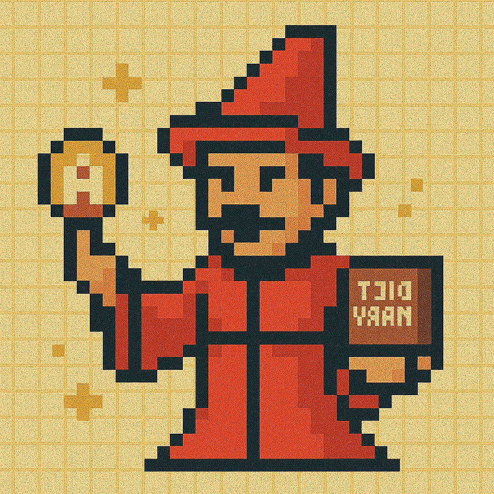
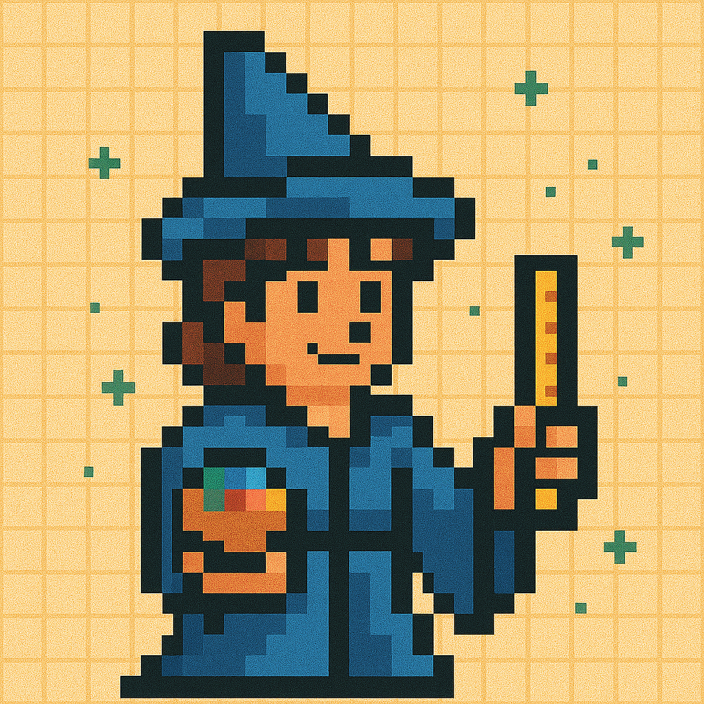
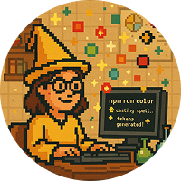

A powerful collection of scripts to generate and manage design tokens for your design system. Each wizard specializes in creating specific types of tokens, ensuring consistency and efficiency across your projects.

## 📋 Table of Contents

- [🧙 Getting Started](#-getting-started)
- [🗂 Project Structure](#-project-structure)
- [🎨 Color Tokens Wizard](#-color-tokens-wizard)
- [🔤 Typography Tokens Wizard](#-typography-tokens-wizard)
- [🔳 Space Tokens Wizard](#-space-tokens-wizard)
- [📏 Size Tokens Wizard](#-size-tokens-wizard)
- [🔲 Border Radius Tokens Wizard](#-border-radius-tokens-wizard)
- [🧹 Clear Tokens Spell](#-clear-tokens-spell)
- [🔄 Merge Tokens Spell](#-merge-tokens-spell)
- [📦 Dependencies](#-dependencies)
- [📝 License](#-license)
- [❓ Troubleshooting and FAQ](#-troubleshooting-and-faq)
- [📬 Contact and Support](#-contact-and-support)
- [🤝 Contributing](#-contributing)

## 🧙 Getting Started

1. **Install Node.js**  
   Download and install [Node.js](https://nodejs.org/) on your machine.

2. **Install VS Code**  
   Download and install [Visual Studio Code](https://code.visualstudio.com/) for an enhanced development experience.

3. **Open Terminal**

   - **VS Code:** Press `` Ctrl + ` `` (Windows/Linux) or `` Cmd + ` `` (Mac)
   - **System Terminal:**
     - Windows: `Windows + R`, type `cmd`
     - Mac: `Command + Space`, type `terminal`
     - Linux: `Ctrl + Alt + T`

4. **Download/Clone the Repository**

   [Download ZIP](https://github.com/fulviabuonanno/design-tokens-wizards/archive/refs/heads/master.zip)

   or

   Clone Repo
   git clone https://github.com/fulviabuonanno/design-tokens-wizards.git
   cd design-tokens-wizards

5. **Install Dependencies**

   ```sh
   npm install
   ```

6. **Run the Scripts**  
   Choose from the following wizards:

| Token Wizard             | Script Name    | Run Command     | Description                              | Version  |
| ------------------------ | -------------- | --------------- | ---------------------------------------- | -------- |
| 🟡 **COLOR WIZ**         | `color-wiz.js` | `npm run color` | Generate and manage color tokens         | 2.9.0 ✅ |
| 🔴 **TYPOGRAPHY WIZ**    | `typo_wiz.js`  | `npm run typo`  | Generate and manage typography tokens    | 1.2.3    |
| 🟣 **SPACE WIZ**         | `space_wiz.js` | `npm run space` | Generate and manage spacing tokens       | 1.7.2    |
| 🔵 **SIZE WIZ**          | `size_wiz.js`  | `npm run size`  | Generate and manage size tokens          | 1.7.2    |
| 🟢 **BORDER RADIUS WIZ** | `radii_wiz.js` | `npm run radii` | Generate and manage border radius tokens | 1.7.2    |

| Spell           | Script Name      | Run Command     | Description                                            | Version  |
| --------------- | ---------------- | --------------- | ------------------------------------------------------ | -------- |
| **MERGE SPELL** | `merge_spell.js` | `npm run merge` | Combine all token files into a single unified file     | 1.3.3 ✨ |
| **CLEAR SPELL** | `clear_spell.js` | `npm run clear` | Remove all generated output files in one swift command | 1.2.2    |

Legend:
✨ Patch // 🌟 Minor Change // ✅ Major Change

## 🗂 Project Structure

```
src/
  wizards/         # All wizard scripts (color, typo, space, size, radii)
  spells/          # Utility scripts (merge, clear)
  assets/          # Images and other static assets
output_files/      # Where generated tokens are saved
  tokens/
    json/          # JSON token files
    css/           # CSS token files
    scss/          # SCSS token files
  final/           # Final merged token files
info/              # Additional project information
```

## 🎨 **Color Tokens Wizard**



Version 2.8.2

Conjure a dazzling palette for your design system with the Color Tokens Wizard 🧙! This magical script guides you through every step of crafting flexible, scalable color tokens—no spellbook required.

1. **Invoke the Wizard**  
   Cast the color spell in your terminal:

   ```sh
   npm run color
   ```

2. **Choose Token Type**  
   Select your color token foundation:

   - **Global Colors**
   - **Semantic Colors** (coming soon; currently redirects to Global)

3. **Set Category**  
   (Optional) Organize your tokens by category (e.g., primitives, foundation, core, basics, essentials, global, roots, or custom). Enter your own if you wish.

4. **Set Naming Level**  
   (Optional) Add a naming level for extra clarity (e.g., color, colour, palette, scheme, or custom).

5. **Enter Base Color**  
   Provide a HEX color code (e.g., `#FABADA`). Preview your magical hue.

6. **Name Your Color**  
   Give your color a unique name (e.g., `blue`, `yellow`, `red`). The wizard ensures no duplicates in your chosen structure.

7. **Select Scale Type**  
   Decide how your color stops will be generated:

   - **Incremental:** 100, 200, 300, 400
   - **Ordinal:** 01, 02, 03, 04 or 1, 2, 3, 4
   - **Alphabetical:** A, B, C, D or a, b, c, d
   - **Semantic Stops:** dark, base, light, etc.

8. **Set Number of Stops**  
   Choose how many stops (shades) to generate (1–20, depending on scale type).

9. **Customize Color Mix Range**  
   (Optional) Set the minimum and maximum mix percentages
   (default: 10%–90%) to control how your base color blends with white and black for the lightest and darkest stops.

10. **Preview and Confirm**  
    Review your color scale in a table, complete with token names and HEX values.
    You can set the middle tone as the `base` if you wish. Confirm to proceed or restart to adjust.

11. **Expand Your Palette**  
    Add more colors and repeat the process as many times as you like.

12. **Export and Convert**  
    When you're done, the wizard:

    - Exports tokens in Tokens Studio JSON format (HEX by default)
    - Offers to convert tokens to RGB, RGBA, HSL, and/or OKLCH
    - Generates CSS and SCSS files for each format
    - Cleans up unused files

    Your magical artifacts will appear in:

    - JSON: `output_files/tokens/json/color/color_tokens_{format}.json`
    - CSS: `output_files/tokens/css/color/color_variables_{format}.css`
    - SCSS: `output_files/tokens/scss/color/color_variables_{format}.scss`

13. **Review Your Spellwork**  
    The wizard lists all updated, new, and deleted files for your review.

---

**Note:**

- Semantic color support is planned but not yet available.
- All steps allow for custom input and confirmation before proceeding.
- The wizard ensures no duplicate color names in your chosen structure.
- You can always restart a step to adjust your input.

---

## 🔤 **Typography Tokens Wizard**



Version 1.2.3

Craft a harmonious typographic elixir for your design system with the Typography Tokens Wizard 🧙! This wizard helps you blend font families, sizes, weights, spacing, and heights into a cohesive typography system.

1. **Invoke the Wizard**  
   Cast the typography spell in your terminal:

   ```sh
   npm run typo
   ```

2. **Choose Your Properties**  
   Select which typography properties you wish to configure:

   - Font Families
   - Font Sizes
   - Font Weights
   - Letter Spacing
   - Line Heights

3. **Configure Font Family**

   - Name your property (fontFamily, font-family, fonts, ff, or custom)
   - Define 1–3 font families with fallbacks
   - Choose naming convention:
     - Semantic (primary, secondary, tertiary)
     - Purpose-based (title, body, details)
     - Ordinal (1, 2, 3, 4)
     - Alphabetical (A, B, C, D)

4. **Configure Font Size**

   - Name your property (fontSize, font-size, size, fs, or custom)
   - Select scale type:
     - 4-Point Grid
     - 8-Point Grid
     - Modular Scale
     - Custom Intervals
     - Fibonacci Scale
   - Choose unit (px, rem, em)
   - Define 1–12 sizes with naming convention:
     - T-shirt (xs, sm, md, lg, xl)
     - Incremental (100, 200, 300, 400)
     - Ordinal (1, 2, 3, 4)
     - Alphabetical (A, B, C, D)

5. **Configure Font Weight**

   - Name your property (fontWeight, font-weight, weight, fw, or custom)
   - Select from standard weights (100–900)
   - Choose naming convention:
     - T-shirt (xs to xl)
     - Semantic (thin to bold)
     - Ordinal (1 to 5)
     - Purpose-based (body, heading...)

6. **Configure Letter Spacing**

   - Name your property (letterSpacing, letter-spacing, tracking, ls, or custom)
   - Choose scale type:
     - Predetermined Scale (-1.25 to 6.25)
     - Custom Values
   - Select unit (em, rem, %)
   - Define 1–7 values with naming convention:
     - T-shirt (xs to xl)
     - Incremental (100, 200, 300...)
     - Ordinal (01, 02... or 1, 2...)
     - Alphabetical (a, b, c...)

7. **Configure Line Height**

   - Name your property (lineHeight, line-height, leading, lh, or custom)
   - Choose scale type:
     - Predetermined Scale 1 (1.1, 1.25, 1.5, 1.6, 1.75, 2.0)
     - Predetermined Scale 2 (1.0, 1.2, 1.5, 1.6, 2.0)
     - Custom Values
   - Choose naming convention:
     - T-shirt (xs to xl)
     - Semantic (tight, normal, loose, relaxed, spacious)
     - Ordinal (1 to 5)
     - Purpose-based (body, heading, display, compact, expanded)
     - Incremental (100, 200, 300...)
     - Alphabetical (a, b, c...)

8. **Preview Your Tokens**  
   For each property, you'll see a preview table showing your configured values.

9. **Generate Your Artifacts**  
   Once confirmed, the wizard will:

   - Export your tokens in Tokens Studio JSON format
     Stored in: `output_files/tokens/json/typography/typography_tokens.json`
   - Generate CSS and SCSS files
     - CSS: `output_files/tokens/css/typography/typography_variables.css`
     - SCSS: `output_files/tokens/scss/typography/typography_variables.scss`

10. **Finalize Your Spell**  
    Review the output files and integrate your typography tokens into your system.

---

**Note:**

- Each step includes accessibility guidelines and recommendations.
- The wizard suggests optimal values while allowing customization.
- You can always restart a step to adjust your input.

---

## 🔳 **Space Tokens Wizard**


Version 1.7.2

Conjure the perfect spacing system for your design with the Space Tokens Wizard 🧙! This wizard helps you create a harmonious set of spacing tokens that will bring balance and rhythm to your layouts.

1. **Invoke the Wizard**  
   Cast the space spell in your terminal:

   ```sh
   npm run space
   ```

2. **Define Base Unit**  
   The default base unit for space tokens is pixels (px).

3. **Name Your Space Tokens**  
   Provide a name for your space tokens (e.g., space, spc).

4. **Select Scale Type**  
   Choose a predefined scale for your tokens:

   - 4-Point Grid System
   - 8-Point Grid System
   - Modular Scale (multiplier based)
   - Custom Intervals
   - Fibonacci Scale

5. **Set Number of Values**  
   Specify how many space values you want to generate (e.g., 6 values for a small-to-large scale).

6. **Choose Naming Convention**  
   Select a naming pattern for your space tokens:

   - T-shirt Sizes (xs, sm, md, lg, xl)
   - Incremental (100, 200, 300, 400)
   - Ordinal (1, 2, 3, 4)
   - Alphabetical (A, B, C, D)

7. **Preview Your Tokens**  
   The wizard will show your space tokens preview:

   ```
   Name: Space
   ┌─────────┬─────────┐
   │ Scale   │ Value   │
   ├─────────┼─────────┤
   │ 01      │ 16px    │
   │ 02      │ 24px    │
   │ 03      │ 32px    │
   │ 04      │ 40px    │
   └─────────┴─────────┘
   ```

8. **Generate Your Artifacts**  
   Once confirmed, the wizard will:

   - Export your tokens in Tokens Studio JSON format
     Stored in: `output_files/tokens/space/space_tokens_{unit}.json`
   - Create CSS and SCSS files with your tokens as variables
     Stored in `output_files/tokens/css/space/space_variables_{unit}.css` and `output_files/tokens/scss/space/space_variables_{unit}.scss`

9. **Finalize Your Spell**  
   Review the output files and integrate your space tokens into your system.

---

## 📏 **Size Tokens Wizard**



Version 1.7.2

Conjure the perfect sizing system for your design with the Size Tokens Wizard 🧙! This wizard helps you create a harmonious set of size tokens that will bring consistency and precision to your layouts.

1. **Invoke the Wizard**  
   Cast the size spell in your terminal:

   ```sh
   npm run size
   ```

2. **Define Base Unit**  
   The default base unit for size tokens is pixels (px).

3. **Name Your Size Tokens**  
   Provide a name for your size tokens (e.g., size, sz).

4. **Select Scale Type**  
   Choose a predefined scale for your tokens:

   - 4-Point Grid System
   - 8-Point Grid System
   - Modular Scale (multiplier based)
   - Custom Intervals
   - Fibonacci Scale

5. **Set Number of Values**  
   Specify how many size values you want to generate (e.g., 6 values for a small-to-large scale).

6. **Choose Naming Convention**  
   Select a naming pattern for your size tokens:

   - T-shirt Sizes (xs, sm, md, lg, xl)
   - Incremental (100, 200, 300, 400)
   - Ordinal (1, 2, 3, 4)
   - Alphabetical (A, B, C, D)

7. **Preview Your Tokens**  
   The wizard will show your size tokens preview:

   ```
   Name: Size
   ┌─────────┬─────────┐
   │ Scale   │ Value   │
   ├─────────┼─────────┤
   │ 01      │ 16px    │
   │ 02      │ 24px    │
   │ 03      │ 32px    │
   │ 04      │ 40px    │
   └─────────┴─────────┘
   ```

8. **Generate Your Artifacts**  
   Once confirmed, the wizard will:

   - Export your tokens in Tokens Studio JSON format
     Stored in: `output_files/tokens/size/size_tokens_{unit}.json`
   - Create CSS and SCSS files with your tokens as variables
     Stored in `output_files/tokens/css/size/size_variables_{unit}.css` and `output_files/tokens/scss/size/size_variables_{unit}.scss`

9. **Finalize Your Spell**  
   Review the output files and integrate your size tokens into your system.

---

## 🔲 **Border Radius Tokens Wizard**


Version 1.7.2

Conjure the perfect border radius system for your design with the Border Radius Tokens Wizard 🧙! This wizard helps you create a harmonious set of border radius tokens that will bring elegance and consistency to your UI elements.

1. **Invoke the Wizard**  
   Cast the border radius spell in your terminal:

   ```sh
   npm run radius
   ```

2. **Define Base Unit**  
   The default base unit for border radius tokens is pixels (px).

3. **Name Your Border Radius Tokens**  
   Provide a name for your border radius tokens (e.g., radius, rad).

4. **Select Scale Type**  
   Choose a predefined scale for your tokens:

   - 4-Point Grid System
   - 8-Point Grid System
   - Modular Scale (multiplier based)
   - Custom Intervals
   - Fibonacci Scale

5. **Set Number of Values**  
   Specify how many border radius values you want to generate (e.g., 6 values for a small-to-large scale).

6. **Choose Naming Convention**  
   Select a naming pattern for your border radius tokens:

   - T-shirt Sizes (xs, sm, md, lg, xl)
   - Incremental (100, 200, 300, 400)
   - Ordinal (1, 2, 3, 4)
   - Alphabetical (A, B, C, D)

7. **Preview Your Tokens**  
   The wizard will show your border radius tokens preview:

   ```
   Name: Radius
   ┌─────────┬─────────┐
   │ Scale   │ Value   │
   ├─────────┼─────────┤
   │ 01      │ 4px     │
   │ 02      │ 8px     │
   │ 03      │ 12px    │
   │ 04      │ 16px    │
   └─────────┴─────────┘
   ```

8. **Generate Your Artifacts**  
   Once confirmed, the wizard will:

   - Export your tokens in Tokens Studio JSON format
     Stored in: `output_files/tokens/radius/radius_tokens_{unit}.json`
   - Create CSS and SCSS files with your tokens as variables
     Stored in `output_files/tokens/css/radius/radius_variables_{unit}.css` and `output_files/tokens/scss/radius/radius_variables_{unit}.scss`

9. **Finalize Your Spell**  
   Review the output files and integrate your border radius tokens into your system.

---

## 🧹 **Clear Tokens Spell**


Version 1.2.2

Conjure a clean slate with the Clear Tokens Spell 🧙! This spell helps you remove all generated token files, giving you a fresh start for your design system.

1. **Invoke the Spell**  
   Cast the clear spell in your terminal:

   ```sh
   npm run clear
   ```

2. **Preview Your Cleanup**  
   The spell will show a preview of the files to be removed:

   ```
   Files to remove:
   - output_files/tokens/color/
   - output_files/tokens/typography/
   - output_files/tokens/space/
   - output_files/tokens/size/
   - output_files/tokens/border-radius/
   - output_files/tokens/final/
   ```

3. **Confirm Your Cleanup**  
   Once confirmed, the spell will:

   - Remove all generated token files
   - Clear all output directories
   - Reset the workspace for a fresh start

4. **Finalize Your Spell**  
   Your workspace is now clean and ready for new token generation.

---

**Note:**

- The spell ensures a complete cleanup of all generated files.
- You can always restart a step to adjust your selection.
- Make sure to backup any important files before running this spell.

---

### 🔄 **Merge Tokens Spell**


Version 1.3.3

Conjure a unified design system by merging your token files with the Merge Tokens Spell 🧙! This spell combines multiple token files into a single, cohesive design system file, ensuring consistent naming conventions across your tokens.

1. **Invoke the Spell**  
   Cast the merge spell in your terminal:

   ```sh
   npm run merge
   ```

2. **Select Token Files**  
   Choose the token files you want to merge:

   - Color tokens
   - Typography tokens
   - Space tokens
   - Size tokens
   - Border radius tokens

3. **Configure Token Formats**  
   The spell will automatically review which files are available in your `output/tokens` folder. For each token type found, select your preferred format:

   - Colors: Choose between HEX, RGB, RGBA, HSL or OKLCH
   - Typography: Select units (px, rem, em)
   - Space: Choose units (px, rem, em)
   - Size: Select units (px, rem, em)
   - Border Radius: Choose units (px, rem, em)

4. **Choose Naming Convention**  
    Select how you want your tokens to be named in the merged file:

   - camelCase (e.g., primaryColor, fontSize)
   - kebab-case (e.g., primary-color, font-size)
   - snake_case (e.g., primary_color, font_size)
   - PascalCase (e.g., PrimaryColor, FontSize)

5. **Generate Your Artifacts**  
   Once confirmed, the spell will:

   - Create a merged tokens file in Tokens Studio JSON format
     Stored in: `output_files/final/tokens.json`
   - Create CSS and SCSS files with all your tokens as variables
     Stored in `output_files/final/tokens.css` and `output_files/final/tokens.scss`

6. **Finalize Your Spell**  
   Review the merged files and integrate them into your design system.

---

**Note:**

- The spell ensures all your tokens are properly combined.
- You can always restart a step to adjust your selection.
- The merged files are ready to use in your development workflow.
- All token names will be transformed to match your chosen naming convention.
- All values will be converted to your selected formats.

---

## Created with Love in Barcelona by Fulvia Buonanno 🪄❤️



Discover more about our wizards at: [Design Tokens Wizards Website](https://designtokenswizards.framer.website/)

If you're passionate about design systems and tokens, this tool is your perfect companion, allowing you to create tokens effortlessly. For RPG or JRPG fans, this tool will evoke a sense of nostalgia, blending classic gaming vibes with your design workflow. 🧩

Created with love by Fulvia Buonanno, a Design Systems Designer based in Barcelona, this tool aims to bridge the gap between design and development, making tokens more accessible, especially for newcomers to this magical world. 🧙

## 📦 Dependencies

Below is a comprehensive list of all dependencies used in this project:

| Dependency                               | Version | Description                                                     | Repository                                                                                                           |
| ---------------------------------------- | ------- | --------------------------------------------------------------- | -------------------------------------------------------------------------------------------------------------------- |
| **chalk**                                | ^5.4.1  | Terminal string styling done right                              | [chalk/chalk](https://github.com/chalk/chalk)                                                                        |
| **cli-table3**                           | ^0.6.5  | Pretty unicode tables for the command line                      | [cli-table3](https://github.com/cli-table/cli-table3)                                                                |
| **inquirer**                             | ^12.4.2 | A collection of common interactive command line user interfaces | [SBoudrias/Inquirer.js](https://github.com/SBoudrias/Inquirer.js)                                                    |
| **path**                                 | ^0.12.7 | Node.js path module                                             | [nodejs/node](https://github.com/nodejs/node)                                                                        |
| **tinycolor2**                           | ^1.6.0  | Fast, small color manipulation and conversion                   | [bgrins/TinyColor](https://github.com/bgrins/TinyColor)                                                              |
| **puppeteer**                            | ^20.0.0 | Headless Chrome Node.js API for automating web interactions     | [puppeteer/puppeteer](https://github.com/puppeteer/puppeteer)                                                        |
| **@builtwithjavascript/oklch-converter** | ^0.9.2  | OKLCH color space converter                                     | [npmjs.com/@builtwithjavascript/oklch-converter](https://www.npmjs.com/package/@builtwithjavascript/oklch-converter) |

---

## 📝 License

This project is licensed under the MIT License. This means you are free to use, modify, and distribute the software as long as the original copyright notice and permission notice are included in all copies or substantial portions of the software.

For more details, you can read the full license text in the [LICENSE](./LICENSE) file included in this repository or visit the Open Source Initiative for more information.

---

## ❓ Troubleshooting and FAQ

**Q: How can I provide feedback or report issues?**  
A: We welcome your feedback! You can:

- Reach out to us on our [website](https://designtokenswizards.framer.website/)
- Fill out this [form](https://tally.so/r/m6V6Po/)

Your feedback helps us improve the tool and make it better for everyone. We're particularly interested in:

- Bug reports
- Feature requests
- Documentation improvements
- User experience feedback
- Performance issues

**Q: I get a permission error or "command not found"?**  
A: Make sure you have Node.js (v18+) installed and are running commands from the project root.

**Q: Where are my generated files?**  
A: Check the `output_files/` directory.

**Q: How do I reset/clean all generated files?**  
A: Run `npm run clear` to remove all generated output.

**Q: Can I use these tokens with my design tool?**  
A: Yes! The tokens are exported in multiple formats (JSON, CSS, SCSS) that can be used with most design tools and development environments.

**Q: How do I update the tokens after making changes?**  
A: Simply run the wizard again with your new values. The files will be updated automatically.

**Q: Can I customize the naming convention for my tokens?**  
A: Yes! Each wizard allows you to choose from different naming conventions (T-shirt sizes, incremental numbers, ordinal numbers, etc.).

**Q: What's the difference between the Merge Spell and Clear Spell?**  
A: The Merge Spell combines all your token files into a single unified file, while the Clear Spell removes all generated files to start fresh.

**Q: How do I contribute to the project?**  
A: Check out our [Contributing](#-contributing) section for guidelines. We welcome all contributions!

**Q: Can I use these tokens in my commercial project?**  
A: Yes! This project is licensed under MIT, which means you can use it freely in any project, including commercial ones.

**Q: What color formats are supported?**  
A: The Color Tokens Wizard supports HEX, RGB, RGBA, HSL, and OKLCH formats. You can choose your preferred format during the generation process.

**Q: Can I use custom fonts in the Typography Wizard?**  
A: Yes! You can specify any font family, including custom fonts. Just make sure to include proper fallbacks for better cross-platform compatibility.

**Q: What units are supported for spacing and sizing?**  
A: The Space and Size Wizards support px, rem, and em units. You can choose your preferred unit during the generation process.

**Q: How do I maintain consistency across different projects?**  
A: Use the Merge Spell to combine tokens from different projects, and consider creating a token library for shared components.

**Q: What's the best way to organize my token files?**  
A: We recommend organizing tokens by category (color, typography, spacing, etc.) and using the Merge Spell to combine them when needed.

**Q: Can I automate token generation in my CI/CD pipeline?**  
A: Yes! The wizards can be run from the command line, making them perfect for automation in your development workflow.

**Q: Can I use these tokens with my CSS framework?**  
A: Yes! The tokens are exported in standard formats (CSS, SCSS) that can be used with any CSS framework or vanilla CSS.

**Q: Something else isn't working!**  
A: Please [open an issue](https://github.com/fulviabuonanno/design-tokens-wizards/issues) or contact [me](mailto:designtokenswizards@gmail.com).

---

## 🤝 Contributing

Contributions, issues, and feature requests are welcome!  
Feel free to check the [issues page](https://github.com/fulviabuonanno/design-tokens-wizards/issues) or submit a pull request.

Please see [CONTRIBUTING.md](CONTRIBUTING.md) for guidelines.

### ☕️ Support the Project

If you find this tool helpful and want to show your appreciation, consider buying me a coffee! Your support helps me maintain and improve the Design Tokens Wizards, making it even more magical for everyone.

[](https://ko-fi.com/fbuonanno)

Every coffee helps me:

- Add new features and improvements
- Fix bugs and maintain the codebase
- Create more documentation and examples
- Keep the magic alive! ✨

Even a small contribution makes a big difference in keeping this project thriving. Thank you for being part of our magical community! 🧙‍♀️

---
