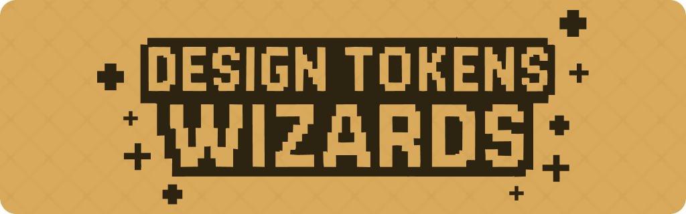

[English](./README.md) | [Español](./README.es.md)

A powerful collection of scripts to generate and manage design tokens for your design system. Each wizard specializes in creating specific types of tokens, ensuring consistency and efficiency across your projects.

## 📋 Table of Contents

- [🧙 Getting Started](#-getting-started)
- [🗂 Project Structure](#-project-structure)
- [✨ Wizards and Spells](#-wizards-and-spells)
- [📦 Dependencies](#-dependencies)
- [📝 License](#-license)
- [❓ Troubleshooting and FAQ](#-troubleshooting-and-faq)
- [📬 Contact and Support](#-contact-and-support)
- [🤝 Contributing](#-contributing)

## 🧙 Getting Started

1. **Install Node.js**  
   Download and install [Node.js](https://nodejs.org/) on your machine.

2. **Install VS Code**  
   Download and install [Visual Studio Code](https://code.visualstudio.com/) for an enhanced development experience.

3. **Open Terminal**

   - **VS Code:** Press `` Ctrl + ` `` (Windows/Linux) or `` Cmd + ` `` (Mac)
   - **System Terminal:**
     - Windows: `Windows + R`, type `cmd`
     - Mac: `Command + Space`, type `terminal`
     - Linux: `Ctrl + Alt + T`

4. **Download/Clone the Repository**

   [Download ZIP](https://github.com/fulviabuonanno/design-tokens-wizards/archive/refs/heads/master.zip)

   or

   Clone Repo
   git clone https://github.com/fulviabuonanno/design-tokens-wizards.git
   cd design-tokens-wizards

5. **Dependencies**

   The repository includes all necessary dependencies (node_modules) so you can run the wizards immediately without installing anything.

6. **Run the Scripts**  
   Choose from the following wizards:

| Token Wizard             | Script Name    | Run Command     | Description                              | Version |
| ------------------------ | -------------- | --------------- | ---------------------------------------- | ------- |
| 🟡 **COLOR WIZ**         | `color-wiz.js` | `npm run color` | Generate and manage color tokens         |  |
| 🔴 **TYPOGRAPHY WIZ**    | `typo_wiz.js`  | `npm run typo`  | Generate and manage typography tokens    |  |
| 🟣 **SPACE WIZ**         | `space_wiz.js` | `npm run space` | Generate and manage spacing tokens       |  |
| 🔵 **SIZE WIZ**          | `size_wiz.js`  | `npm run size`  | Generate and manage size tokens          |  |
| 🟢 **BORDER RADIUS WIZ** | `radii_wiz.js` | `npm run radii` | Generate and manage border radius tokens |  |

| Spell           | Script Name      | Run Command     | Description                                            | Version |
| --------------- | ---------------- | --------------- | ------------------------------------------------------ | ------- |
| **MERGE SPELL** | `merge_spell.js` | `npm run merge` | Combine all token files into a single unified file     |  |
| **CLEAR SPELL** | `clear_spell.js` | `npm run clear` | Remove all generated output files in one swift command |  |

## 🗂 Project Structure

```
src/
  wizards/         # All wizard scripts (color, typo, space, size, radii)
  spells/          # Utility scripts (merge, clear)
  assets/          # Images and other static assets
output_files/      # Where generated tokens are saved
  tokens/
    json/          # JSON token files
    css/           # CSS token files
    scss/          # SCSS token files
  final/           # Final merged token files
pdf/               # PDF documentation
docs/
  en/              # English documentation
  es/              # Spanish documentation
```

## ✨ Wizards and Spells

This project provides a suite of "wizards" and "spells" to help you manage your design tokens. 

### Wizards

*   [🎨 Color Tokens Wizard](./docs/en/color-wizard.md) - **New in v2.12.0:** Enhanced UX with clearer step organization and visual hierarchy. **v2.11.0:** Industry-standard preset configurations for quick setup! Choose from 15+ popular color scale formats (Tailwind, Material Design, Chakra UI, Ant Design, IBM Carbon, Adobe Spectrum, and more) or create custom configurations with full control. Batch mode supports bulk and individual color entry methods.
*   [🔤 Typography Tokens Wizard](./docs/en/typography-wizard.md)
*   [🔳 Space Tokens Wizard](./docs/en/space-wizard.md)
*   [📏 Size Tokens Wizard](./docs/en/size-wizard.md)
*   [🔲 Border Radius Tokens Wizard](./docs/en/border-radius-wizard.md)

### Spells

*   [🧹 Clear Tokens Spell](./docs/en/clear-spell.md)
*   [🔄 Merge Tokens Spell](./docs/en/merge-spell.md)

## Created with Love in Barcelona by Fulvia Buonanno 🪄❤️


Discover more about our wizards at: [Design Tokens Wizards Website](https://www.designtokenswizards.com)

If you're passionate about design systems and tokens, this tool is your perfect companion, allowing you to create tokens effortlessly. For RPG or JRPG fans, this tool will evoke a sense of nostalgia, blending classic gaming vibes with your design workflow. 🧩

Created with love by Fulvia Buonanno, a Design Systems Designer based in Barcelona, this tool aims to bridge the gap between design and development, making tokens more accessible, especially for newcomers to this magical world. 🧙

## 📦 Dependencies

Below is a comprehensive list of all dependencies used in this project:

| Dependency                               | Version | Description                                                     | Repository                                                                                                           |
| ---------------------------------------- | ------- | --------------------------------------------------------------- | -------------------------------------------------------------------------------------------------------------------- |
| **@builtwithjavascript/oklch-converter** | ^0.9.2  | OKLCH color space converter                                     | [npmjs.com/@builtwithjavascript/oklch-converter](https://www.npmjs.com/package/@builtwithjavascript/oklch-converter) |
| **chalk**                                | ^5.4.1  | Terminal string styling done right                              | [chalk/chalk](https://github.com/chalk/chalk)                                                                        |
| **cli-table3**                           | ^0.6.5  | Pretty unicode tables for the command line                      | [cli-table3](https://github.com/cli-table/cli-table3)                                                                |
| **inquirer**                             | ^12.4.2 | A collection of common interactive command line user interfaces | [SBoudrias/Inquirer.js](https://github.com/SBoudrias/Inquirer.js)                                                    |
| **path**                                 | ^0.12.7 | Node.js path module                                             | [nodejs/node](https://github.com/nodejs/node)                                                                        |
| **tinycolor2**                           | ^1.6.0  | Fast, small color manipulation and conversion                   | [bgrins/TinyColor](https://github.com/bgrins/TinyColor)                                                              |

---

## 📝 License

This project is licensed under the MIT License. This means you are free to use, modify, and distribute the software as long as the original copyright notice and permission notice are included in all copies or substantial portions of the software.

For more details, you can read the full license text in the [LICENSE](./LICENSE) file included in this repository or visit the Open Source Initiative for more information.

---

## ❓ Troubleshooting and FAQ

**Q: How can I provide feedback or report issues?**  
A: We welcome your feedback! You can:

- Reach out to us on our [website](https://www.designtokenswizards.com)
- Fill out this [form](https://tally.so/r/m6V6Po/)

Your feedback helps us improve the tool and make it better for everyone. We're particularly interested in:

- Bug reports
- Feature requests
- Documentation improvements
- User experience feedback
- Performance issues

**Q: I get a permission error or "command not found"?**  
A: Make sure you have Node.js (v18+) installed and are running commands from the project root.

**Q: Where are my generated files?**  
A: Check the `output_files/` directory.

**Q: How do I reset/clean all generated files?**  
A: Run `npm run clear` to remove all generated output.

**Q: Can I use these tokens with my design tool?**  
A: Yes! The tokens are exported in multiple formats (JSON, CSS, SCSS) that can be used with most design tools and development environments.

**Q: How do I update the tokens after making changes?**  
A: Simply run the wizard again with your new values. The files will be updated automatically.

**Q: Can I customize the naming convention for my tokens?**  
A: Yes! Each wizard allows you to choose from different naming conventions (T-shirt sizes, incremental numbers, ordinal numbers, etc.).

**Q: What's the difference between the Merge Spell and Clear Spell?**  
A: The Merge Spell combines all your token files into a single unified file, while the Clear Spell removes all generated files to start fresh.

**Q: How do I contribute to the project?**  
A: Check out our [Contributing](#-contributing) section for guidelines. We welcome all contributions!

**Q: Can I use these tokens in my commercial project?**  
A: Yes! This project is licensed under MIT, which means you can use it freely in any project, including commercial ones.

**Q: What color formats are supported?**  
A: The Color Tokens Wizard supports HEX, RGB, RGBA, HSL, and OKLCH formats. You can choose your preferred format during the generation process.

**Q: Can I use custom fonts in the Typography Wizard?**  
A: Yes! You can specify any font family, including custom fonts. Just make sure to include proper fallbacks for better cross-platform compatibility.

**Q: What units are supported for spacing and sizing?**  
A: The Space and Size Wizards support px, rem, and em units. You can choose your preferred unit during the generation process.

**Q: How do I maintain consistency across different projects?**  
A: Use the Merge Spell to combine tokens from different projects, and consider creating a token library for shared components.

**Q: What's the best way to organize my token files?**  
A: We recommend organizing tokens by category (color, typography, spacing, etc.) and using the Merge Spell to combine them when needed.

**Q: Can I automate token generation in my CI/CD pipeline?**  
A: Yes! The wizards can be run from the command line, making them perfect for automation in your development workflow.

**Q: Can I use these tokens with my CSS framework?**  
A: Yes! The tokens are exported in standard formats (CSS, SCSS) that can be used with any CSS framework or vanilla CSS.

**Q: Something else isn't working!**  
A: Please [open an issue](https://github.com/fulviabuonanno/design-tokens-wizards/issues) or contact [me](mailto:designtokenswizards@gmail.com).

---

## 🤝 Contributing

Contributions, issues, and feature requests are welcome!  
Feel free to check the [issues page](https://github.com/fulviabuonanno/design-tokens-wizards/issues) or submit a pull request.

Please see [CONTRIBUTING.md](CONTRIBUTING.md) for guidelines.

### ☕️ Support the Project

If you find this tool helpful and want to show your appreciation, consider buying me a coffee! Your support helps me maintain and improve the Design Tokens Wizards, making it even more magical for everyone.

[](https://ko-fi.com/fbuonanno)

Every coffee helps me:

- Add new features and improvements
- Fix bugs and maintain the codebase
- Create more documentation and examples
- Keep the magic alive! ✨

Even a small contribution makes a big difference in keeping this project thriving. Thank you for being part of our magical community! 🧙‍♀️

---
